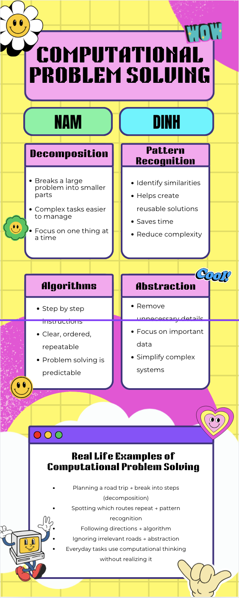

Lesson 3:

Create an Infographic to describe the computational problem-solving concepts: decomposition, pattern recognition, algorithms, and abstraction activity:

Reflection:
After researching the four computational problem solving concepts, I realized I was familiar with all of the terms with my previous computer science knowledge, so I was confident with the information in the infographic. I was very comfortable with the topic so I created the infographic in Canva and customized it with the information about the concepts were, and the real life examples of their use.
