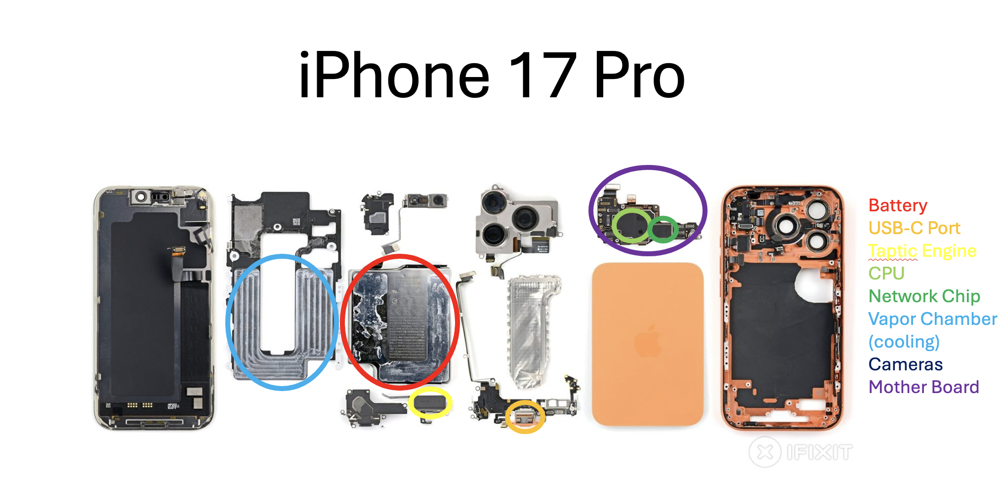
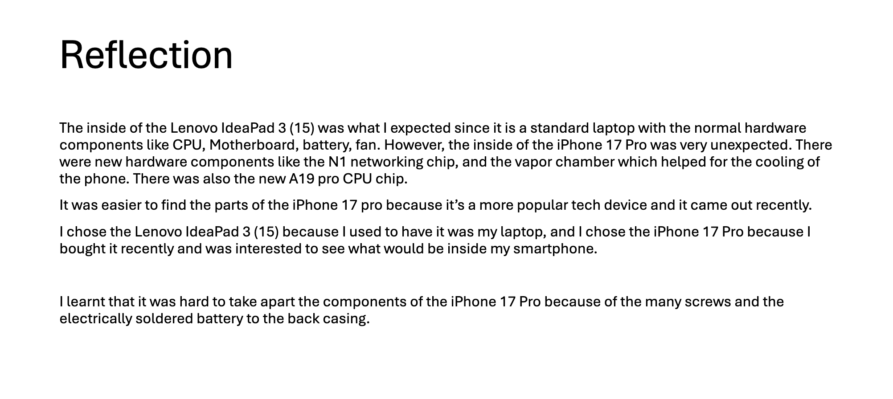

Lesson 4: Hardware

Hardware Dissection Lab Activity:

Reflection Now:
After this activity, I've learned about the different components in laptops and smartphones as well as the similar components that they share. This activity also interested me in the hardware of technology, as I've recently tried to repair my laptop (but failed) but it was still interesting to open up my laptop and see all the hardware components in real life, and this activity helped me with idnetifying the different hardware components inside.

Skills: Research skills, comparative analysis skills, critical thinking skills, graphic designing skills.
