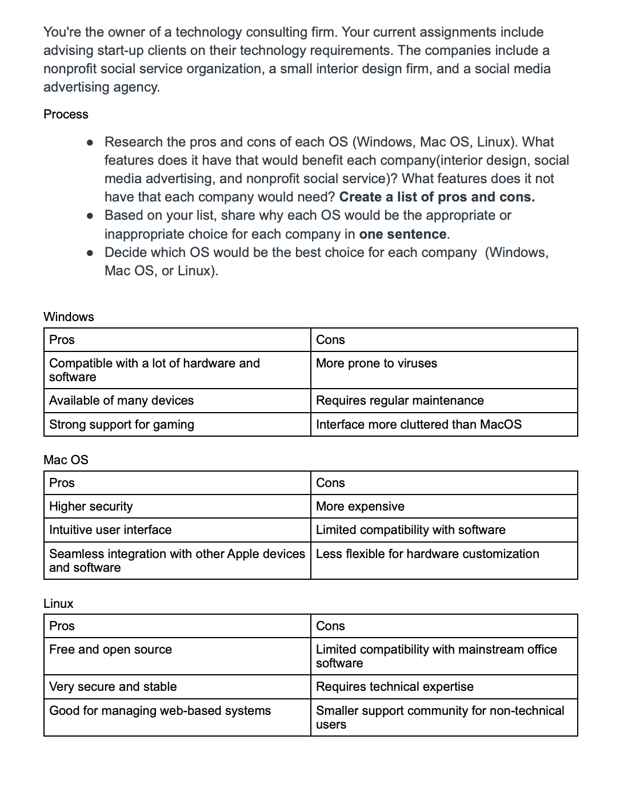
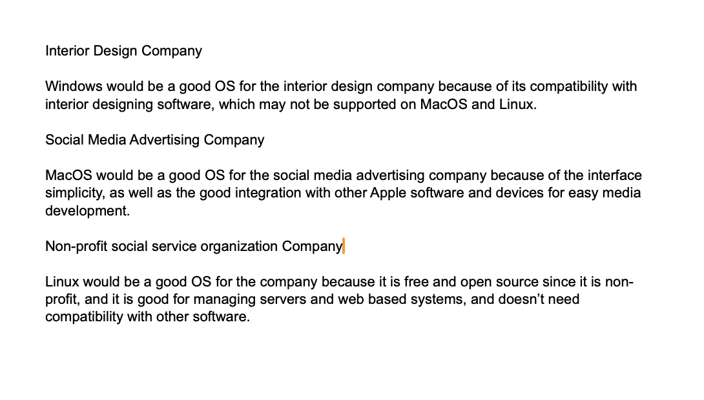

Lesson 5:

Choose the best OS activity:

Reflection:
After researching the 3 different OS, it actually helped me in a real life application to compare my PC operating system. I can use this activity to compare the pros and cons of each operating system to help me decide which is best for my needs. It is also interesting to compare the three main operating systems with newer ones such as SteamOS, which I can use this activity to compare the four of them.

Skills: Research skills, comparative analysis skills, critical thinking skills.
