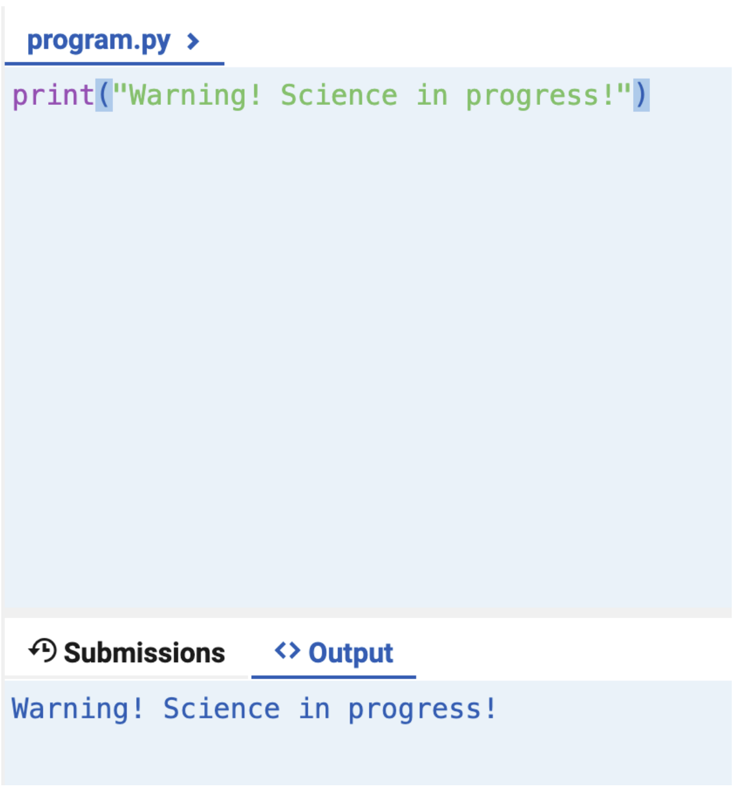
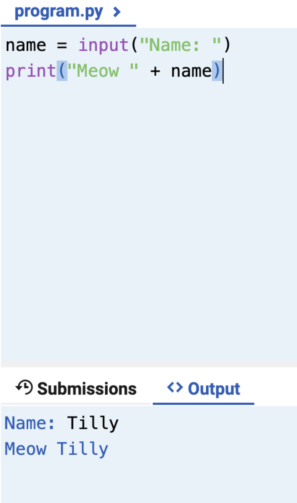
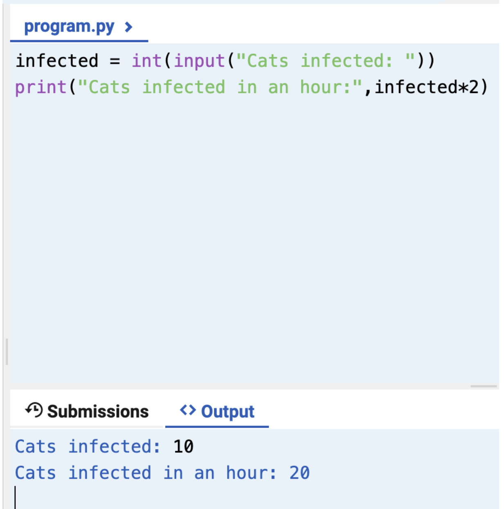

Lesson 6:

Python Programming Activity:

Reflection:
For this activity, I found it very easy as I already take a computer science course this semester as well as previous advanced python knowledge, although it was a nice activity to brush up on my basics.
