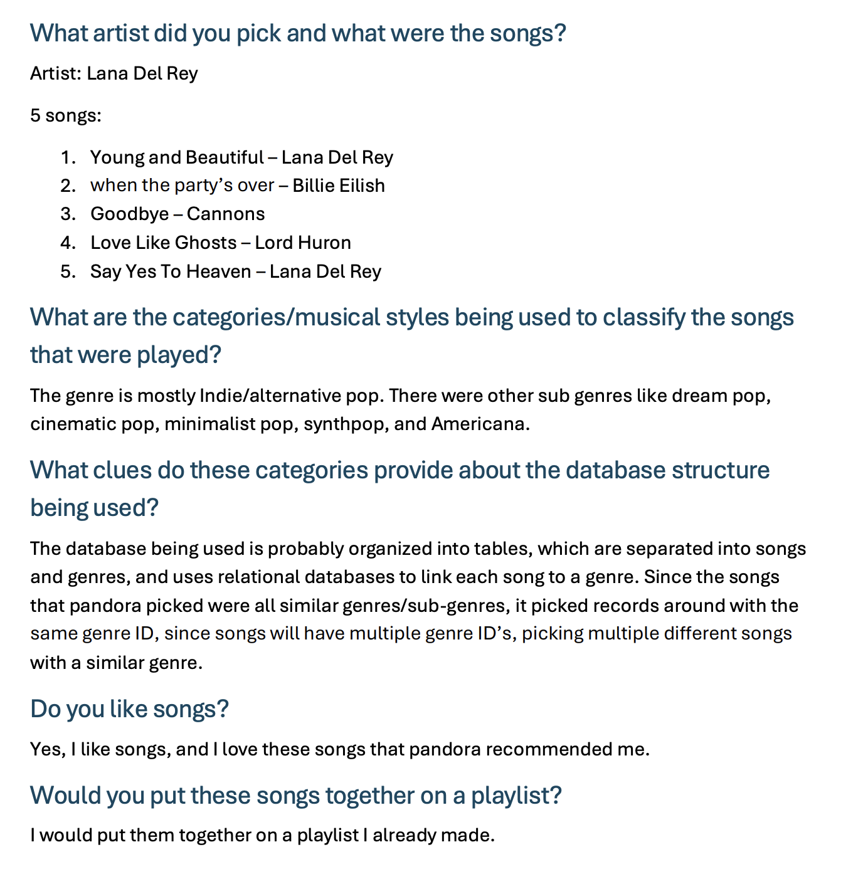
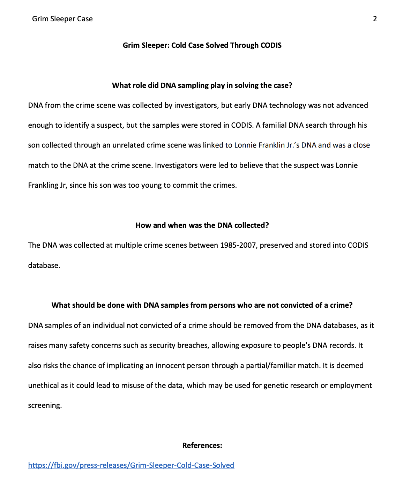

Lesson 7:

Music Genome Project Activity:

Reflection:
This activity was a cool activity to do because I enjoy listening to music, and the concept of music algorithms linking with database systems to produce a similar genre finding system for music. It was good to know how most music playing apps do the reccomended music section which I use all the time.

CODIS Cold Case Activity:

Reflection:
This case was a particularly hard activity for me to do, it was the first time I was introduced to the APA format with the citations and references as well as the amount of time I was doing to research. Overall this activity was helpful for writing scholarly articles and helping me to improve my research and writing skills.
