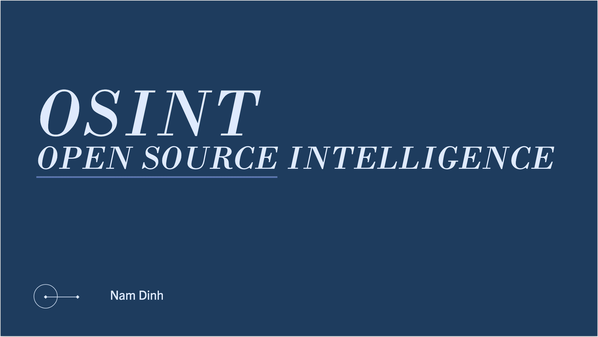
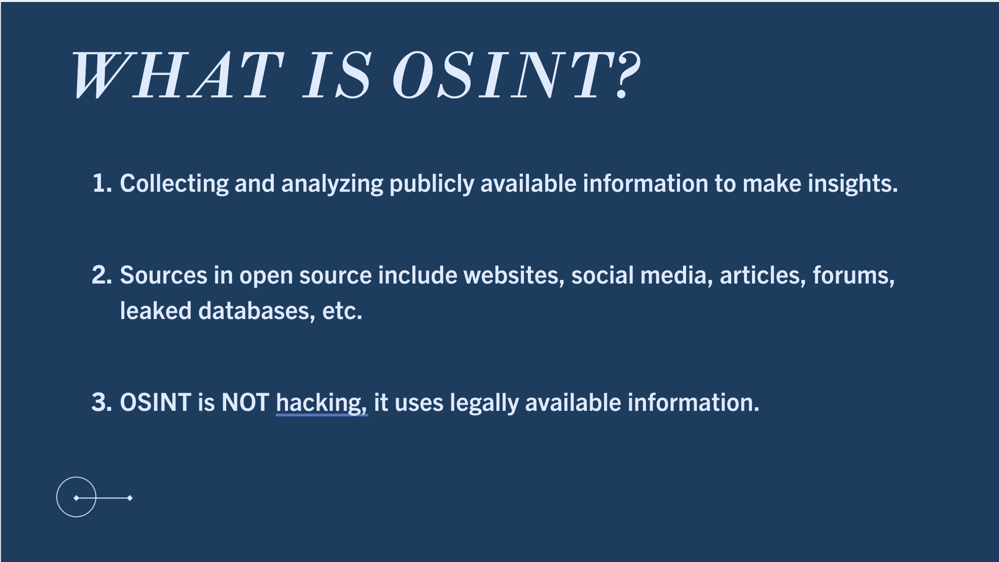
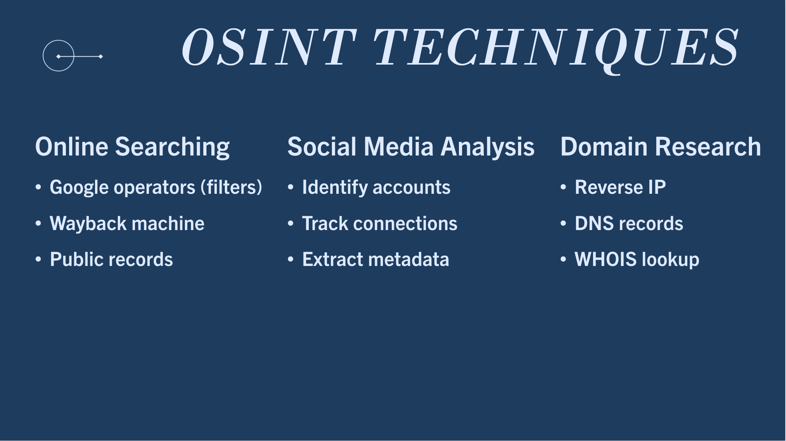
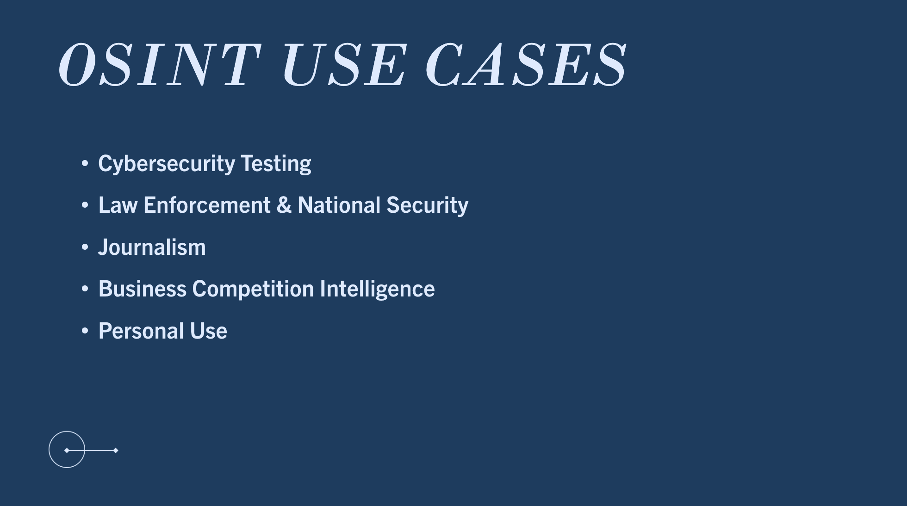
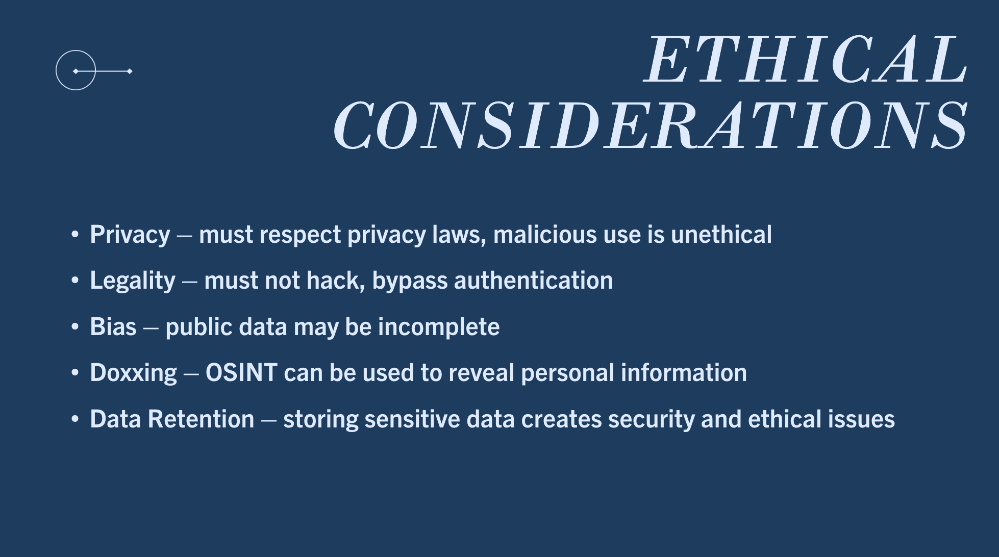
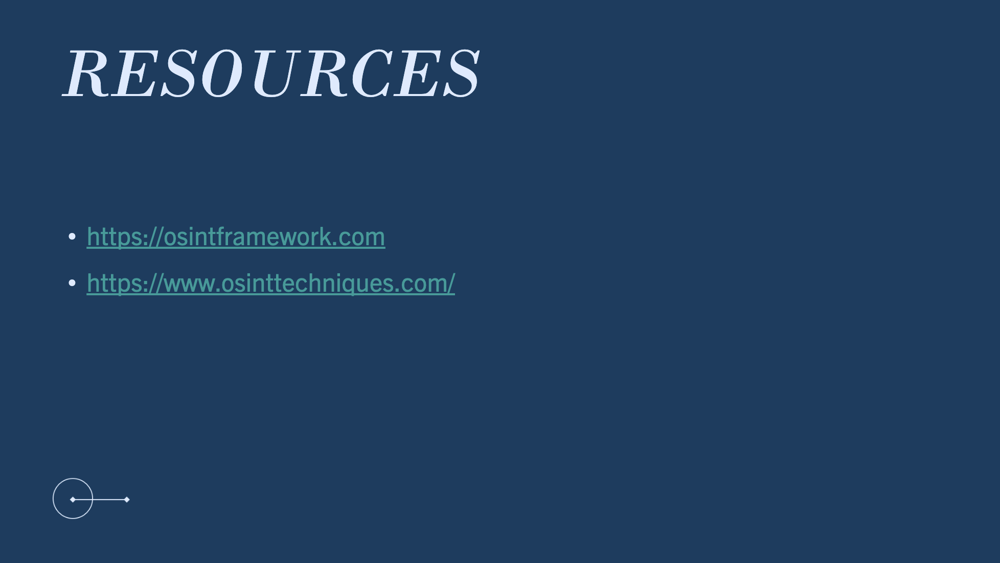

Lesson 8:

OSINT Presentation Activity:

Reflection:
After researching and creating the presentation about OSINT, I've learned a lot about OSINT which is a new concept for me. I compared the differences between OSINT and AI models like ChatGPT, and I learned something new while researching on my own. This presentation really expanded my knowledge on this topic and the more complex framework behind it.

Skills:
Research skills
