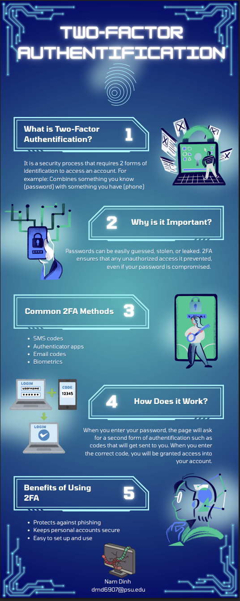

Lesson 9:

Security Infographic Activity:

Reflection:
For the security infographic I chose the topic of two factor authentification because I am familiar with what is it, and I use it almost every day. This made it easier to explain the definition, how it works and its benefits which I can easily recognize.
