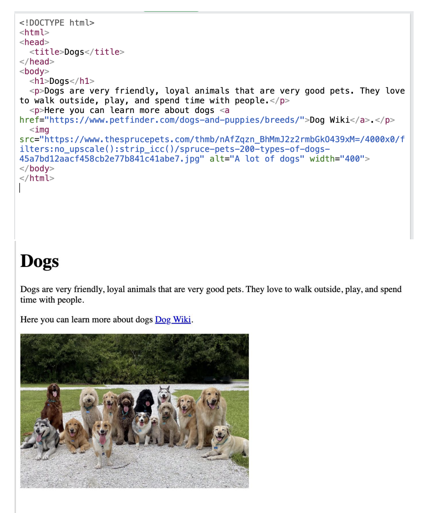
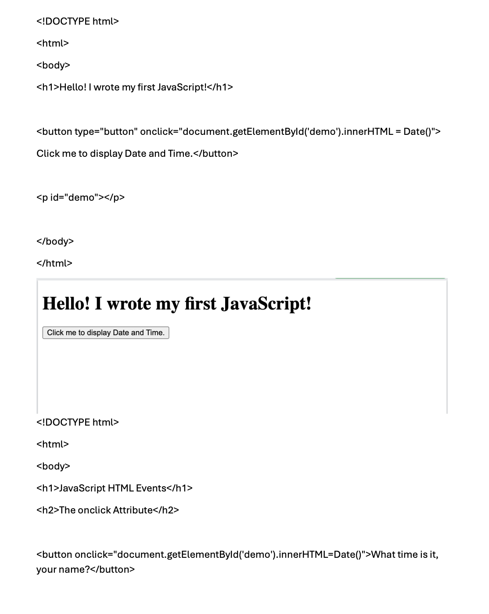
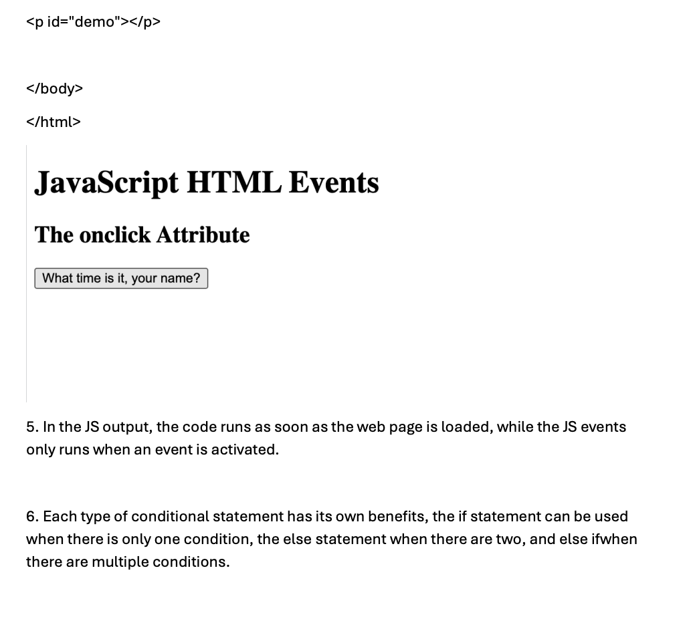

Lesson 10:

HTML Activity:

Reflection:
For this HTML coding activity, it helped me refresh on my HTML coding knowledge which I did a few years ago, so it wasn't my first time coding in HTML, but it was a good activity to remind me of the syntax and coding format of HTML.

JavaScript Activity:

Reflection:
For this JavaScript activity it was my first time coding in JavaScript, however I noticed it was very similar to HTML which made it easier for me to understand a new language, while also learning the key differenced between HTML and Javascript.
