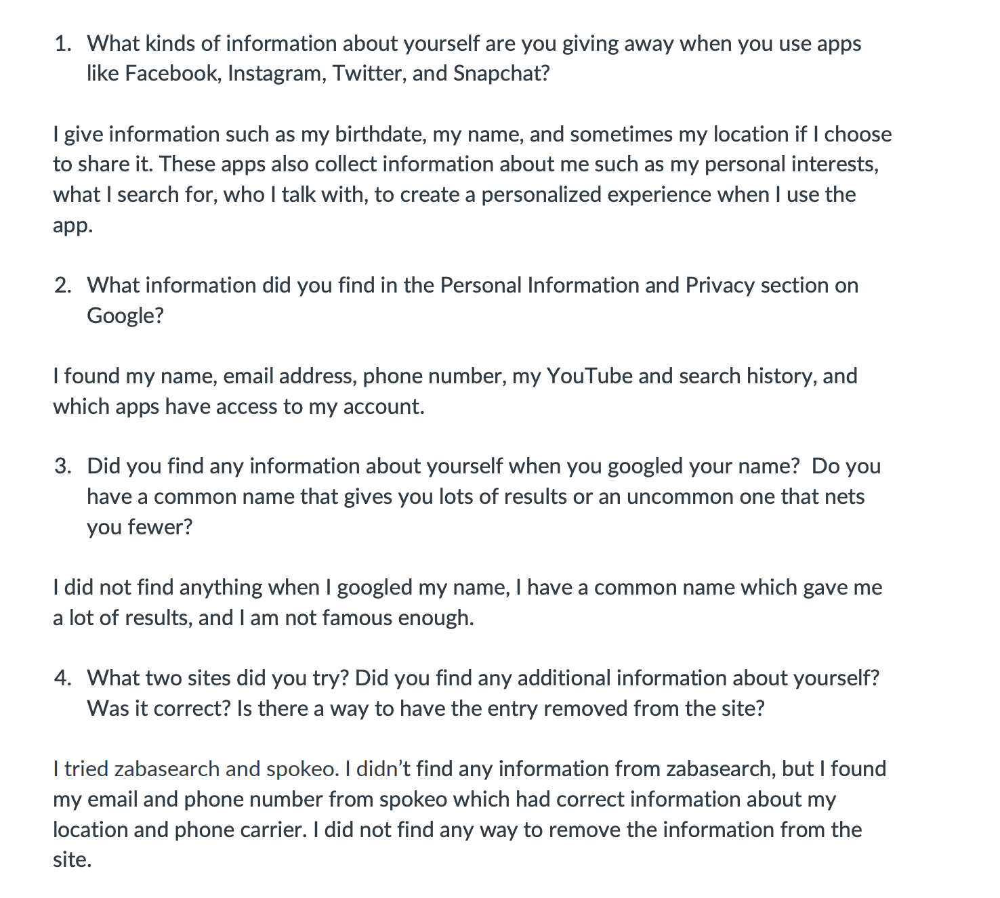

Lesson 11:

What Do Companies Know About You? Activity:

Reflection:
After answering all the questions and trying out the websites from the activity, I realized how much information is out on the internet without your knowledge and how invasive they are. After this activity I was more concerned for my data and what kinds of information people can access about me, making me more self conscious of how much I give away my data. 

Skills:
Research skills, digital literacy skills, online awareness.
