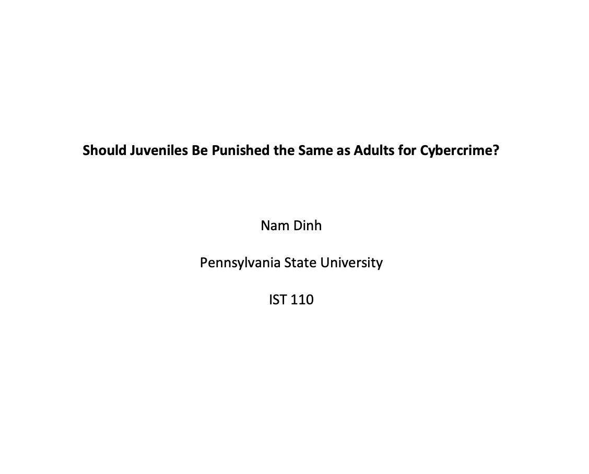
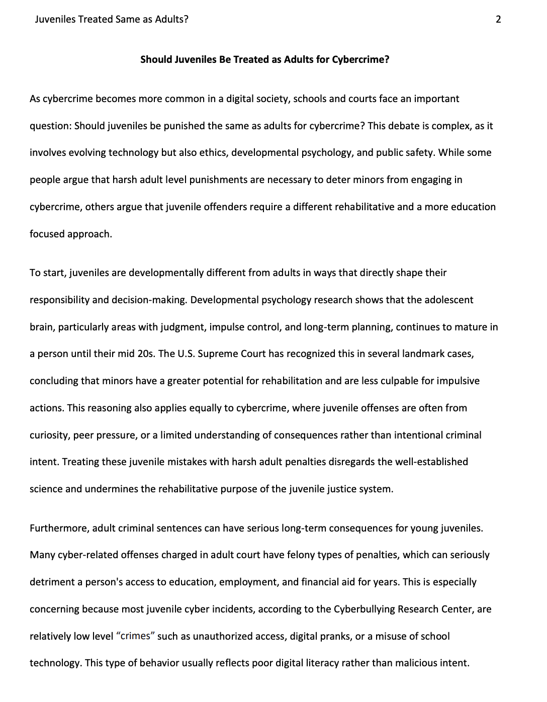
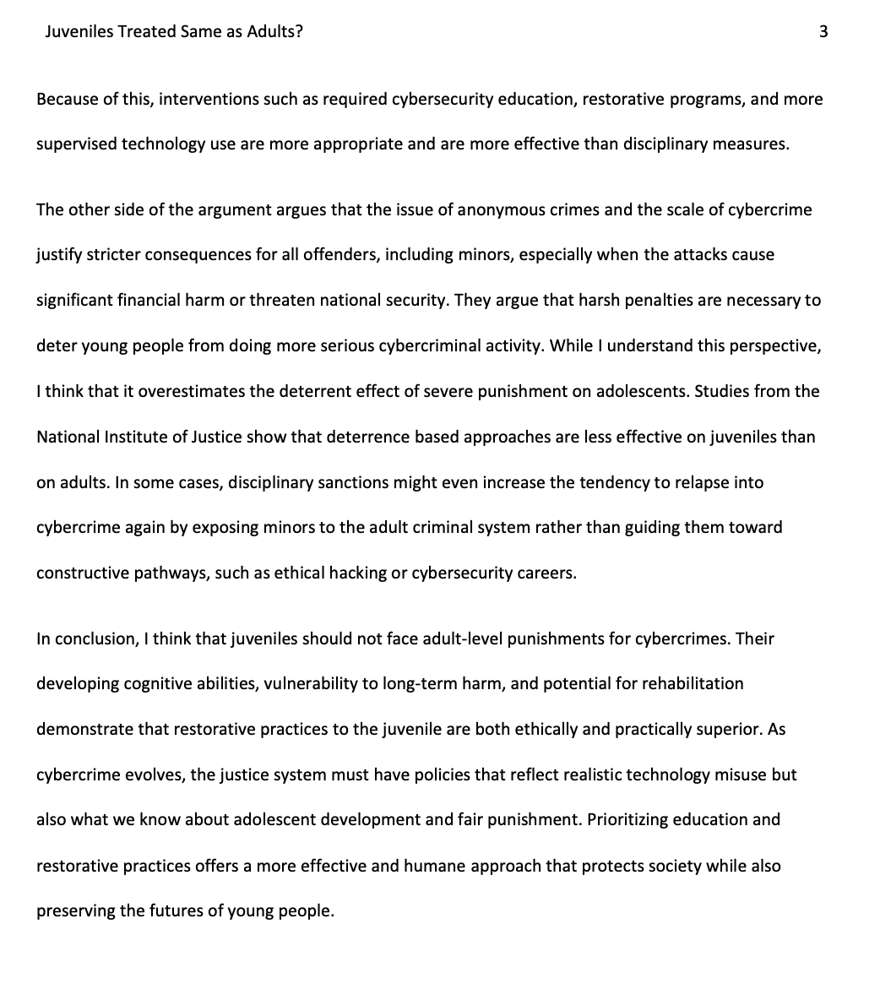
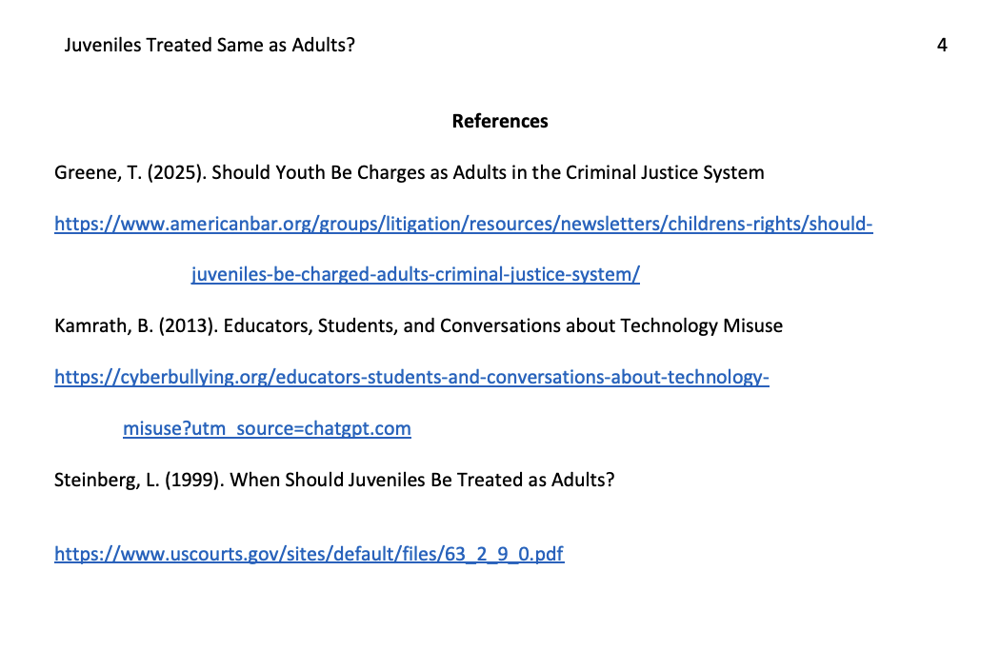

Lesson 12:

Cybercrime Assignment Activity:

Reflection:
After this activity, it was my second time writing an essay in an APA format. This acitivty tested my research and writing skills once again, as well as testing my ethics and debating knowlegde to answer the complex question of whether juveniles should be treated as adults for cybercrimes. I researched points for both sides, and after reviewing the pros and cons for both, I ultimately decided on the side of not treating juveniles as adults for cybercrimes as seen in the essay.

Skills:
Improved my APA format writing skills, research skills.
