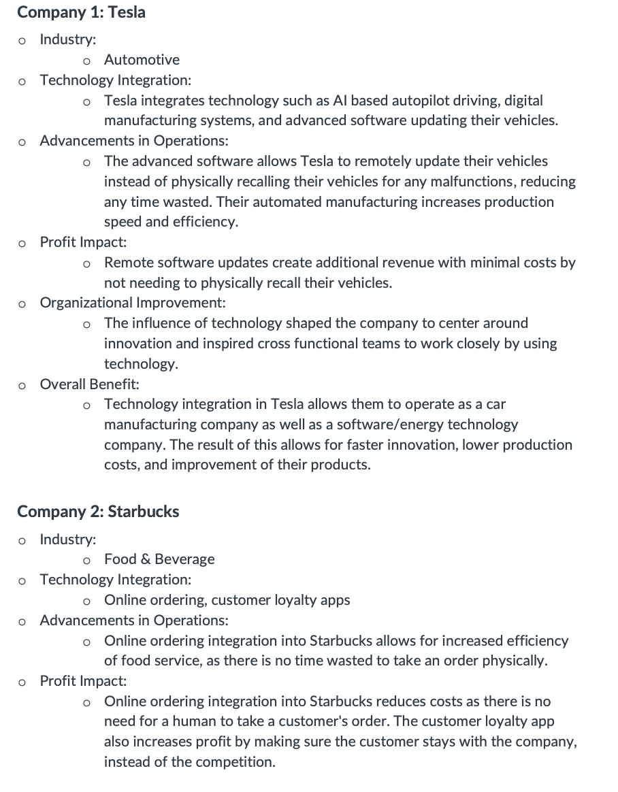
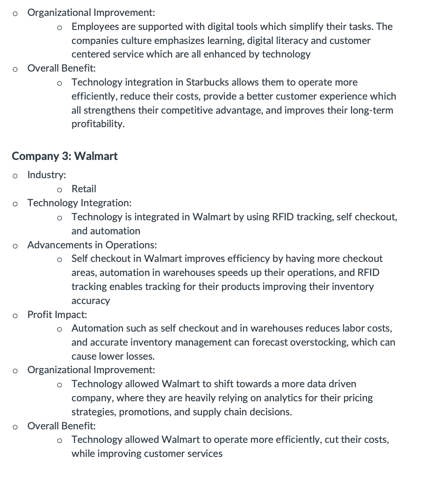

Lesson 13:

Enterprise Technology Integration Activity:

Reflection: This activity helped me gain knowledge on different companies stratedgies on using technology not only to benfit themselves, but their consumers as well, which is a good way to know how they operate and stay competitive in the market, as well as showing how innovation is important.

Skills: I improved my research and critical thinking skills, using previous business studies knowledge to help apply and write the assignment.
